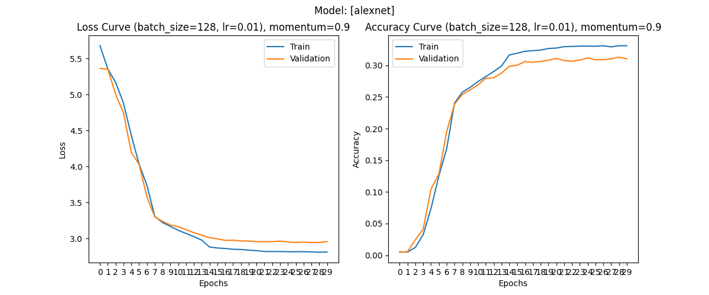

# AlexNet Implementation
A toy project to learn, implement, and train the famous AlexNet Architecture from scratch from the 2012 paper
"[ImageNet Classification with Deep Convolutional Neural Networks](https://proceedings.neurips.cc/paper/2012/file/c399862d3b9d6b76c8436e924a68c45b-Paper.pdf)" simply because we can.

## Some Personal Details on Model Training
- Find a suitable batch size for training. Sticking to $128$ in accordance with AlexNet paper.
- Ensure that data preprocessing transformations are appropriate and desired.

# Results

The final results after training for ~$30$ epochs are as follows:  
`Test Top-1 accuracy: 31.754350662231445 % | Top-5 accuracy: 58.7618670886076`

Considering that the [original AlexNet paper]((https://proceedings.neurips.cc/paper/2012/file/c399862d3b9d6b76c8436e924a68c45b-Paper.pdf)) reports top-1 and top-5 error rate scores of 67.4% and 40.9%
(Top-1 and top-5 accuracies are inversely equivalent being 32.6% and 59.1% respectively) on ImageNet, we can say that the implementation is sufficiently accurate for the Tiny ImageNet dataset.

# Acknowledgements
- [dansuh17/alexnet-pytorch](https://github.com/dansuh17/alexnet-pytorch)
- [ImageNet Classification with Deep Convolutional Neural Networks](https://proceedings.neurips.cc/paper/2012/file/c399862d3b9d6b76c8436e924a68c45b-Paper.pdf)
- [Writing AlexNet from Scratch in PyTorch](https://blog.paperspace.com/alexnet-pytorch/#data-loading)
- https://pytorch.org/hub/pytorch_vision_alexnet/
- [Difference between AlexNet, VGGNet, ResNet, and Inception](https://towardsdatascience.com/the-w3h-of-alexnet-vggnet-resnet-and-inception-7baaaecccc96)