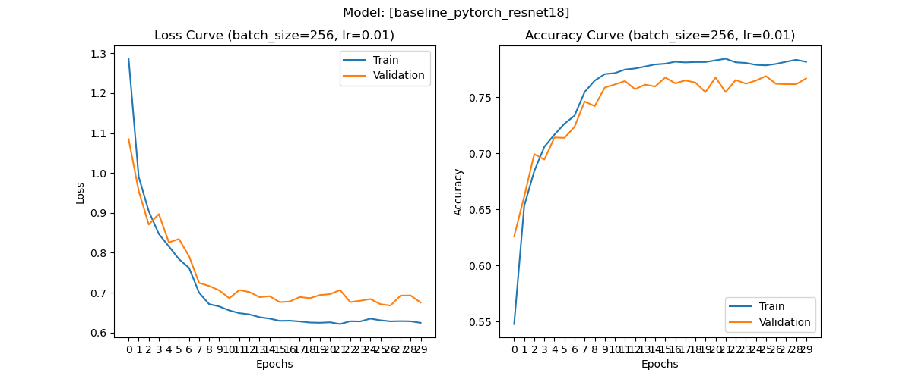
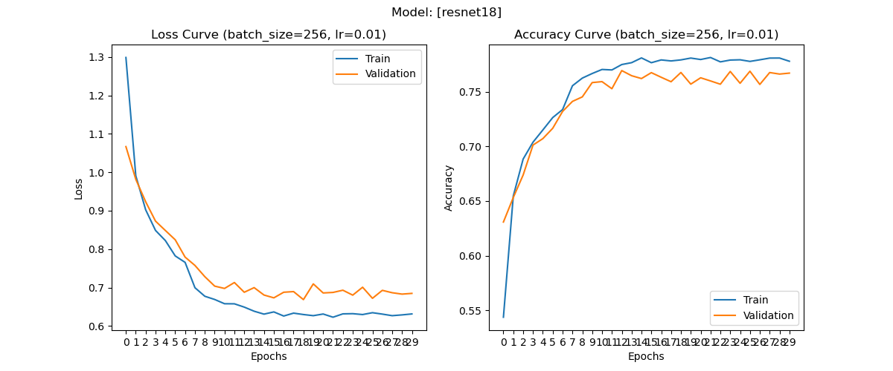

# ResNet-18 Implementation
A toy project to learn, implement, and train our own ResNet-18 on CIFAR-10.

# Results

### Existing PyTorch ResNet-18 Model (Baseline)

### Our ResNet-18 Implementation
We load the pretrained weights from PyTorch's `ResNet18_Weights.IMAGENET1K_V1`.

# Acknowledgements
- [PyTorch CIFAR10 Training Tutorial](https://pytorch.org/tutorials/beginner/blitz/cifar10_tutorial.html)
- [A Detailed Introduction to ResNet and Its Implementation in PyTorch](https://medium.com/@freshtechyy/a-detailed-introduction-to-resnet-and-its-implementation-in-pytorch-744b13c8074a) by Huili Yu
- [Let's reproduce GPT-2 (124M)](https://www.youtube.com/watch?v=l8pRSuU81PU) by Andrej Karpathy
- [Helpful conventions for PyTorch model building](https://github.com/FrancescoSaverioZuppichini/Pytorch-how-and-when-to-use-Module-Sequential-ModuleList-and-ModuleDict/blob/master/README.md) by FrancescoSaverioZuppichini  

